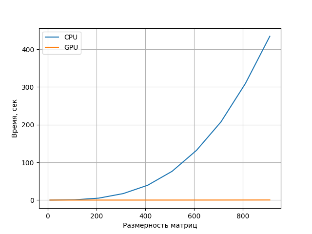

В работе произведено сравнение CPU и GPU на основе произведения матриц. Расчет на GPU произвыодился с использованием библиотеки PyTorch.
Ниже представлен график зависимости времени расчета от размерности матриц.

На данном графике видно, что затраты время на рачёт на центральном процессоре быстро возрастает в геометрической прогресии, когда на графическом процессоре, потраченное время практически не меняется.
