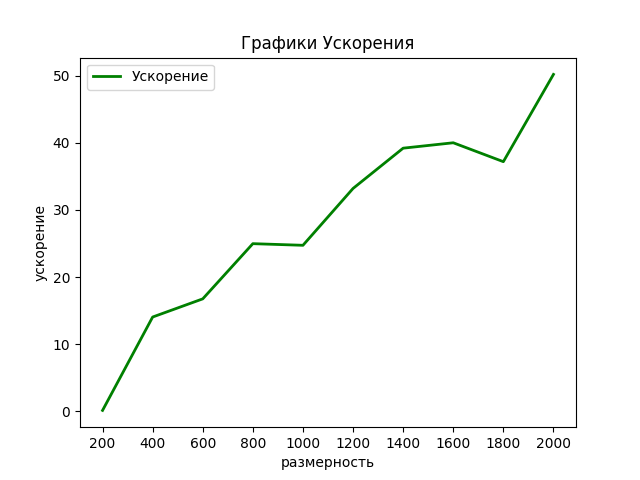

В данной лабораторной работе производился запуск программы для сложения двух векторов с использованием технологии CUDA. В программе необходимо выполнить поиск подстрок в матрицах с различными разрешениями. Измерения проводились на размерностях GridDim (4,4) и BlockDim(8,8) (всего получается 1024 нити). Использовалась библиотека numba.  В таблицах будут представлены усредненые значения по 12 запускам. 
Задачи распараллеливание на CUDA:
1. считывание фото на CPU;
2. переброска матрицы на GPU;
3. расчет на GPU;
4. переброска результата на CPU.   

В таблице представлены результаты -->
| Разрешение  | Время работы CPU в секундах | Время работы GPU в секундах   GridDim (4,4),BlockDim(8,8) |
|-------------|:----------------:|-----------------:|
| 200  | 0.00407491  | 0.02734111 (0.14903973)  | 
| 400  | 0.00814023   | 0.00057922 (14.0538195) | 
| 600  | 0.0124747  | 0.00074436 (16.75889497) | 
| 800  | 0.01655116  | 0.00066264 (24.97742264) |
| 1000 | 0.02036939  | 0.00082352 (24.73461362) | 
| 1200 | 0.0248489	 | 0.00074848 (33.1993523) | 
| 1400 | 0.0290092	 | 0.00074007 (39.19785766) |
| 1600 | 0.03291672	 | 0.00082288 (40.00176256) | 
| 1800 | 0.03706441	 | 0.00099669 (37.18754111) | 
| 2000 | 0.04163386	 | 0.00082964 (50.18322676)  |

На рисунке предствален график ускорения работы  программы на GPU по сравнению с CPU  при GridDim (4,4) и BlockDim(8,8): 

Результаты указывают на то, что при увеличении размерности   ускорение работы на GPU становится более большим, при этом можно сказать, что идельаный случай для расчета на GPU, когда число поток будет равно размерности матрицы. Это позволило бы одному потоку отработать одну операцию и закончить свою работу, нежели ему придется считать несколько операций. Максимального ускорение (50.18322676) удалось достичь при  GridDim (4,4),BlockDim(8,8) при размерности 2000. 

